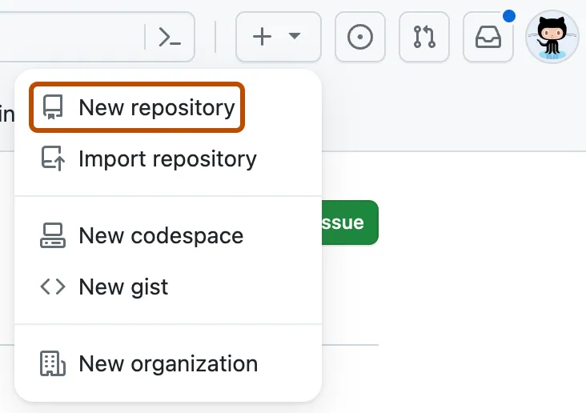
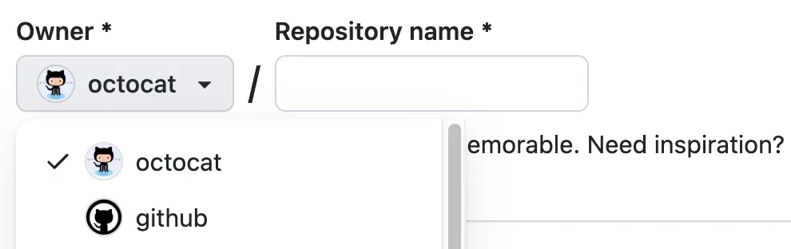
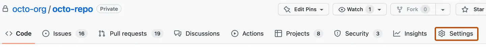
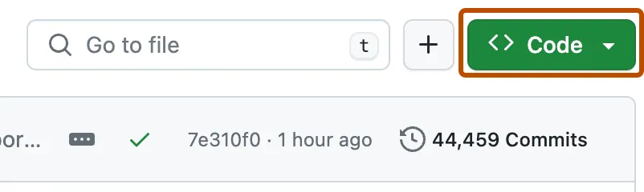
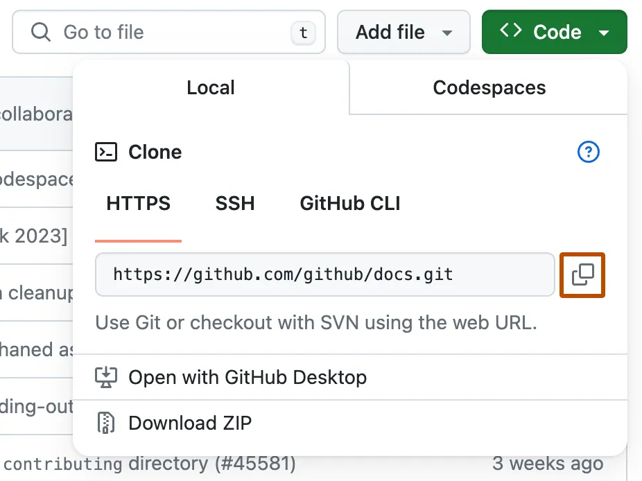

# GitHub Intro
Overview of Software Engineering (COMSM0110) Introduction to Git &amp; GitHub.

By the end of this session you should have:
- Created a GitHub account
- One team member should have created a repository.
- All group members should be added to the repository.
- Names, GitHub Usernames Should be added to the README.
- You should have had the chance to play around with features of GitHub and interacted with the repository using git.

We recommend using a lab machine for this task as it already has Git and VSCode installed. You can of course use an IDE other than VSCode but these instructions use VSCode as an example, other IDEs should provide similar tools for interacting with Git. If you are using your own machine then you will need to [install git](https://git-scm.com/book/en/v2/Getting-Started-Installing-Git).

This will not be the same repository as the one you will use for your coursework. After this lab we will setup a repository for you using your the GitHub name that you provide us.

## 1. Create a GitHub account

1. Go to [GitHub](www.github.com).
2. Click 'Sign Up' in the top right corner.
3. Follow the instructions on the page. 

*We recommend creating a GitHub account using a personal email address. This will allow you to use the account after leaving the university.*

## 2. Create a repository

Only one member of your team needs to complete this section but everyone should follow along with what they are doing.

1. In the upper-right corner of any page, select plus, then click New repository.

2. Use the 'Owner' dropdown menu to select your GitHub account as the owner of the repository.

3. Choose a repository name (no need to put too much thought into this, this is just a test repository which you can delete later).

5. Ensure that the repository is set as `Public`

4. Select `Add a README file`.

5. Click `Create Repository`.

## 3. Add team members to your repository

Only one member of your team needs to complete this section but everyone should follow along with what they are doing.

1. Navigate to the settings tab of the repository.

2. In the "Access" section of the sidebar, click `Collaborators & teams`.

3. Select `Add people` and add team members by searching for their username.

All team members should now have permission to clone the repository and push new or edited code.

## 4. Clone your repository

All team members should complete this section. 

1. On your repository on GitHub click the `code dropdown`

2. Copy the HTTPS address provided

3. Open VSCode

4. Navigate to the Source Control tab on the left sidebar

5. Select `Clone Repository`

6. Paste your HTTPS address into the search bar and select the repository.

7. Follow any instructions given by VSCode on cloning the repository (It may ask you to login to GitHub).

VSCode should automatically open the local repository in the current browser.

## 5. Edit the README.md

Each team member should try out pushing code by editing the README.md file to include their name, university email address and GitHub username. It is essential that you complete this section as this information will allow us to setup your coursework repository.

Since we haven't got on to how to use branches yet, only one team member should do this section at once.

1. Use VSCode to add your name, university email address and GitHub username in the format `<name>, <email>, <github-username>`. e.g. `Alex Elwood, wh20899@bristol.ac.uk, alexelwood14`

2. Use the source control tab in the left sidebar to commit changes to the readme (see additional [docs](https://code.visualstudio.com/docs/sourcecontrol/overview#_commit:~:text=the%20current%20workspace.-,Commit,-Staging%20(git%20add)) if you are stuck).

3. Click the Synchronize Changes button on the bottom left of the window. Once this is complete the change should be visible on GitHub

4. All team members can now Synchronize Changes, and should be able to see the updated README locally.

## 6. Send us your repository

Once each team member has their name, university email address and GitHub username in the README.md, send a link to your repository to Alex Elwood on Teams. In the next few days we will be setting up your coursework repositories and sending out joining invites.  

## 7. Further tasks on Branches (Optional)

The next essential feature of Git is branches. Take a look at the GitHub [documentation](https://docs.github.com/en/pull-requests/collaborating-with-pull-requests/proposing-changes-to-your-work-with-pull-requests/about-branches) on branches and have a go using branches interacting with branches in your test repository. Note: this task has a lot of overlap with Overview of Software Tools.