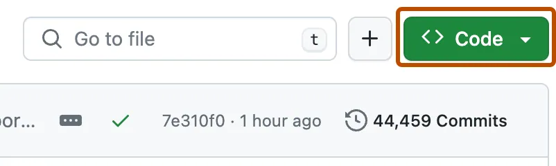
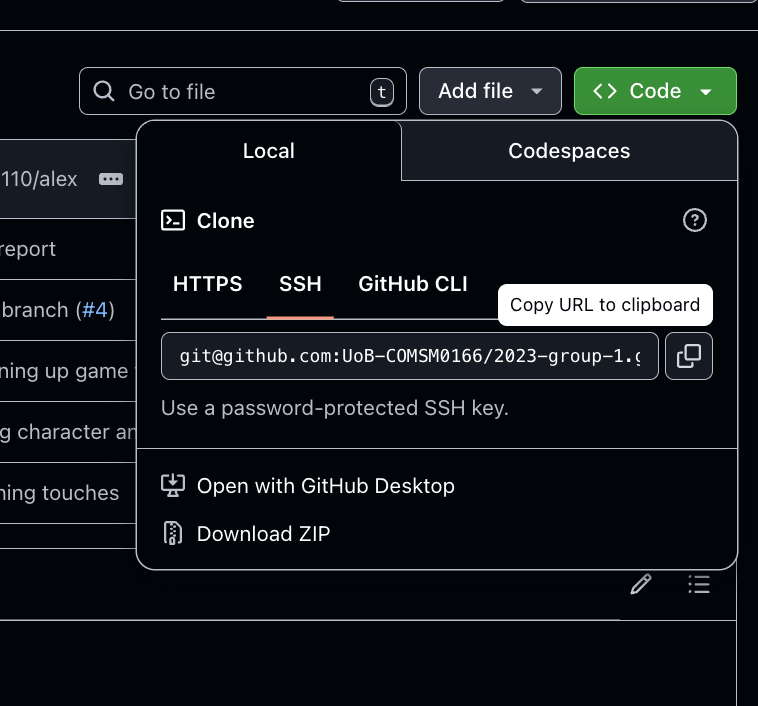

# GitHub Intro -- 27th January 2026
Software Engineering Discipline and Practice (COMSM0166) Introduction to Git &amp; GitHub.

Your team's github repository (repo) has been made for you in the COMSM0166 organisation.  If you have emailed across your team and their GitHub account names, you (plural) will have been invited to the GitHub group for your team, and through that have admin access to your team's repo.  <ins>If you have not yet sent your team members and their GitHub account names to Alex Cockrean, **do so now**</ins>.

This introduction requires only a commandline with Git installed, and a browser for interacting with GitHub.  Both of these are availabe on the lab machine.  If you would like to use your own machine then you will need to [install git](https://git-scm.com/book/en/v2/Getting-Started-Installing-Git).

For the Git sections, this session is going to be using the commandline.  Many IDEs (e.g. VS code) have graphical user interfaces that make the process of commiting and pushing (don't worry, these will be explained later) easier.  And of course, these are what most people use most of the time.  However, it is helpful to understand how to use Git and Github with just the commandline because, when things break (and they will break), the commandline is almost always how you will be fixing them.

## 1. Add SSH key to your GitHub account

In order for your computer to communicate with GitHub securely, it's best to use SSH with GitHub. 
1. Open drop-down menu by clicking on your profile picture in the top right.
2. Go to 'Settings'.
3. Choose 'SSH and GPG keys' from the menu on the left.
4. Click 'New SSH key'.
5. Give it any name you like, and add you ssh <ins>PUBLIC</ins> key to the text box labelled 'Key'.  Then click 'Add SSH key'.

Your SSH keys should be found in the .ssh folder in the home directory of your computer, and the public keys will be in a file ending with '.pub'.  (The .ssh folder is a hidden folder, so you can cd into it normally, but it will not be visible to 'ls' unless you add the -a flag).

## 2. Clone your repository

Everyone in the team needs a local copy of the repository to work on -- so everyone needs to clone it.

1. On your repository on GitHub click the `code dropdown`

2. Copy the SSH address provided

3. Open commandline

4. Move to the directory you want to store your repository in.

5. Run the command "git clone \<copied SSH address\>"

VSCode should automatically open the local repository in the current browser.

## 6. Edit the README.md

Each team member should try out pushing code by editing the README.md file to include their name, university email address and GitHub username. It is essential that you complete this section as this information will allow us to setup your coursework repository.

Since we haven't got on to how to use branches yet, only one team member should do this section at once.

1. Use VSCode to add your name, university email address and GitHub username in the format `<name>, <email>, <github-username>`. e.g. `Alex Cockrean, no22498@bristol.ac.uk, ABenC377`

2. Use the source control tab in the left sidebar to commit changes to the readme (see additional [docs](https://code.visualstudio.com/docs/sourcecontrol/overview#_commit:~:text=the%20current%20workspace.-,Commit,-Staging%20(git%20add)) if you are stuck).

3. Click the Synchronize Changes button on the bottom left of the window. Once this is complete the change should be visible on GitHub

4. All team members can now Synchronize Changes, and should be able to see the updated README locally.

## 7. Send us your repository

Once each team member has their name, university email address and GitHub username in the README.md, send a link to your repository to Alex Cockrean on Teams. In the next few days we will be setting up your coursework repositories and sending out joining invites.  

## 8. Further tasks on Branches (Optional)

The next essential feature of Git is branches. Take a look at the GitHub [documentation](https://docs.github.com/en/pull-requests/collaborating-with-pull-requests/proposing-changes-to-your-work-with-pull-requests/about-branches) on branches and have a go using branches interacting with branches in your test repository. Note: this task has a lot of overlap with Overview of Software Tools.
