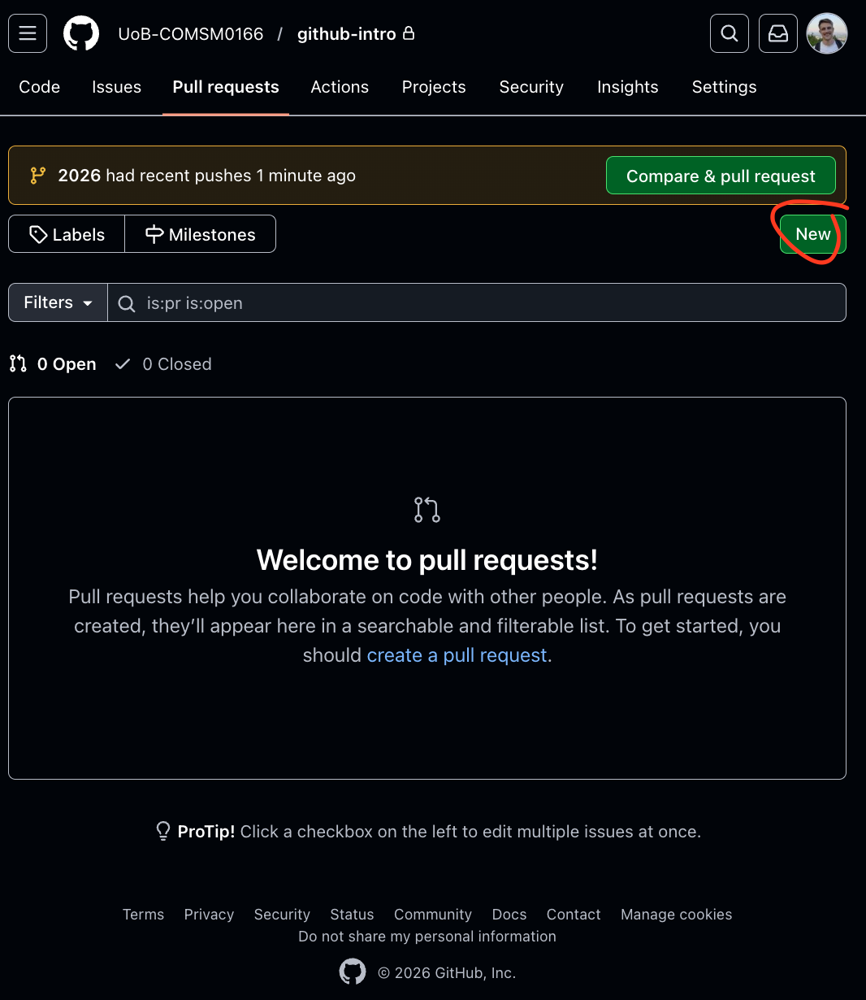
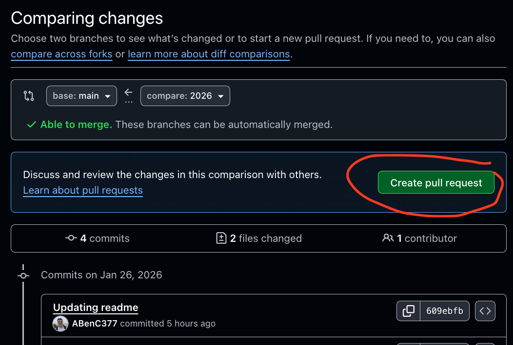

# GitHub Intro -- 27th January 2026
Software Engineering Discipline and Practice (COMSM0166) Introduction to Git &amp; GitHub.

Your team's github repository (repo) has been made for you in the COMSM0166 organisation.  If you have emailed across your team and their GitHub account names, you (plural) will have been invited to the GitHub group for your team, and through that have admin access to your team's repo.  <ins>If you have not yet sent your team members and their GitHub account names to Alex Cockrean, **do so now**</ins>.

This introduction requires only a command line with Git installed, and a browser for interacting with GitHub.  Both of these are availabe on the lab machine.  If you would like to use your own machine then you will need to [install git](https://git-scm.com/book/en/v2/Getting-Started-Installing-Git).

For the Git portion of this session I will be using the command line.  Many IDEs (e.g. VS code) have graphical user interfaces that make the process of `commit`ing and `push`ing (don't worry, these will be explained later) easier.  And, of course, these are what most people use most of the time.  However, it is helpful to understand how to use Git and Github with just the command line because, when things break (and they will break), the command line is almost always how you will be able to fix them.

It is worth noting that there are usually multiple ways of achieving the same goal using git.  I will be presenting one of them.  If you want to have an explore of how else you can use git, the [documentation](https://git-scm.com/docs) tells you what else is possible. 

## 1. Add SSH key to your GitHub account

In order for your computer to communicate with GitHub securely, it's best to use SSH with GitHub. 
1. Open drop-down menu by clicking on your profile picture in the top right.
2. Go to 'Settings'.
3. Choose 'SSH and GPG keys' from the menu on the left.
4. Click 'New SSH key'.
5. Give it any name you like, and add you ssh <ins>PUBLIC</ins> key to the text box labelled 'Key'.  Then click 'Add SSH key'.

Your SSH keys should be found in the .ssh folder in the home directory of your computer, and the public keys will be in a file ending with '.pub'.  (The .ssh folder is a hidden folder, so you can cd into it normally, but it will not be visible to `ls` unless you add the -a flag).

## 2. Clone your repository

Everyone in the team needs a local copy of the repository to work on -- so everyone needs to clone it to their computer.

1. On your repository on GitHub, click the `code dropdown`.

2. Copy the `SSH` address provided (be sure not to use the 'http' address, as this will cause issues with `push`ing later on).

3. Open command line.

4. Move to the directory you want to store your repository in.

5. Run the command `git clone \<copied SSH address\>`.

## 3. Make a new branch to make your changes in

As there will be six team members working on your game at the same time, you don't want to be treading on each others' toes every time you make a slight change.  Therefore, it is good practice to use `branches` to keep work being done on different features isolated from each other until they are finished and ready to be integrated into the main project (called the `main` branch).

1. We're going to make a new branch using the following command: `git branch <branch_name>`.  This creates a new branch (which we can see by checking the existing branches with the command `git branch`).  

2. We're now going to make this new branch our working branch: `git checkout <branch_name>`.

We are now using our new branch locally.  This means that any changes we make to this branch do not affect the `main` branch.  

## 4. Edit the README.md

Each team member should try out `push`ing code by editing the README.md file to include their name, university email address and GitHub username.  (If this has already been done, then make some other minor change to the readme document).

1. Add your name, university email address and GitHub username in the format `<name>, <email>, <github-username>` (e.g. `Alex Cockrean, no22498@bristol.ac.uk, ABenC377`) to the README.md file, and save the changes.

2. Add this changed file to a new commit using the command `git add README.md`.

3. Now, we want to commit this change to the branch.  You can, and often do, add multiple changed files to a commit.  However, for this exercise, we're just committing this trivial change.  The command for commiting is `git commit -m "Adding name to readme"`.  A commit needs a message to help other developers identify what it is for.  We add the commit message using the `-m` flag, and providing a string for the message.  The actual message you use is entirely up to you.

## 5. Pushing your changes to GitHub

We now need to `push` our commit to GitHub, so that it can be seen by the rest of your team.  As we've made a new branch locally which we've commited to, our command is going to be slightly more complicated than it usually would be: `git push -u origin <branch_name>`.  The `-u origin ` here tells git that we are pushing the commit to a new remote branch with the name \<branch_name\>.  

Once you've set up a new branch with GitHub, the pushing process becomes a lot easier, with just a simple `git push`.

## 6. Create a pull request for your changes

We've now made our changes to the new branch public.  Now, to get them into the `main` branch, we need to make a `pull request`.

1. Go to your repository on GitHub. 

2. Under the `Pull requests` tab, click new.

3. Now choose the two branches you want to merge.  We want to merge `<branch_name>` into `main`.  

At this stage, you will see a summary of the commits being included in this pull request (in our case, only a single one), and a summary of all the file changes that are in the pull request.  

4. Click the `Create pull request` button.

5. Now give the pull request a title and description, and click the `Create pull request` button.

## 7. Reviewing and merging

Now that a pull request has been made, you need to make sure that you, as a team, are happy with the changes that are being proposed.  Therefore, your team mates should review the changes.  When everyone is happy with the changes, you can hit the `Merge pull request` button, and your changes will be added to the `main` branch.

Currently, there are no rules on your repositories about when and by whom a pull request can be merged.  This allows someone to make a pull request and immediately merge it by themselves without any oversight from the team.  While this is good for quick development, it is also good for bugs.  Therefore, we recommend setting up some rules in the setting of your repository to protect your main branch by requiring new pull requests to it to be approved by multiple members of the team.  While this is beyond the scope of this exercise, we recommend you read [this](https://docs.github.com/en/repositories/configuring-branches-and-merges-in-your-repository/managing-protected-branches/about-protected-branches) page about just this.

## 8. Updating `main` locally

We've merged our changes with the `main` branch on GitHub.  However, our local copy of `main` is still unchanged.  Therefore, we need to synchronise the two.

1. On your command line, checkout the main branch: `git checkout main`.

2. `pull` any changes that have been made to the repository on GitHub: `git pull`.

You should now see that the change you originally made in your branch has been implemented to your main branch.

# Congratulations, you've merged your first PR
